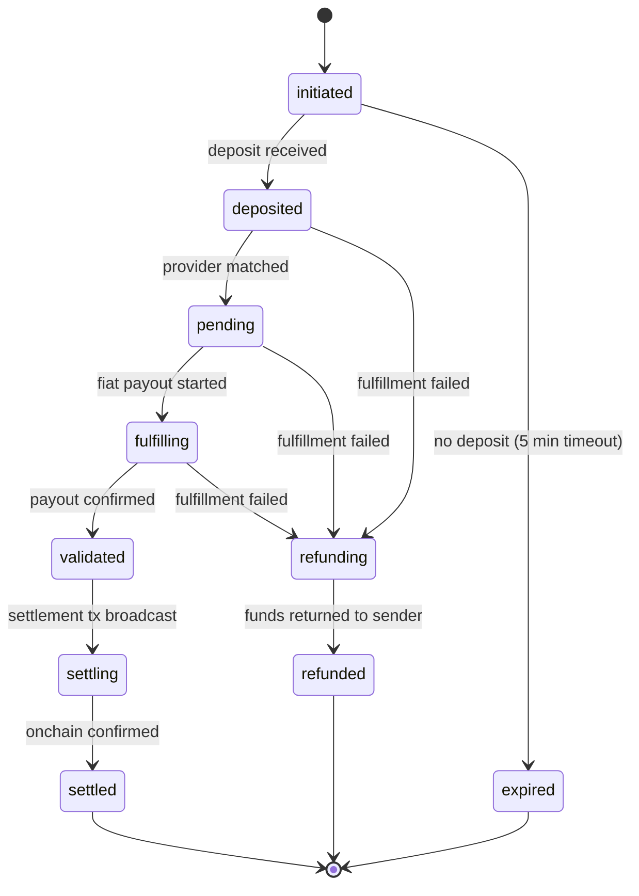
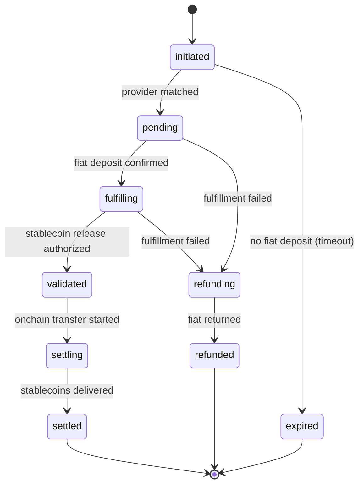

Paycrest supports two payment directions: **offramp** (stablecoin → fiat) and **onramp** (fiat → stablecoin). Both flows follow a similar lifecycle through the protocol.

## Offramp Lifecycle (Stablecoin → Fiat)



<Steps>
  <Step title="initiated">
    Sender creates a payment order via the API or Gateway contract. The order is recorded and a receive address (deposit address) is returned. Funds have not yet arrived.
  </Step>
  <Step title="deposited">
    Stablecoins are detected at the receive address. The protocol confirms the deposit and begins matching.
  </Step>
  <Step title="pending">
    The aggregator has assigned the order to a suitable liquidity provider. The provider's provision node is processing the fiat payout.
  </Step>
  <Step title="fulfilling">
    The provision node is actively disbursing fiat to the recipient's bank account or mobile wallet via a local PSP.
  </Step>
  <Step title="validated">
    The provider has confirmed successful fiat delivery. The order is waiting for onchain settlement.
  </Step>
  <Step title="settling">
    Onchain settlement is in progress — the escrowed stablecoins are being released to the provider.
  </Step>
  <Step title="settled">
    The order is fully closed. Stablecoins have been released to the provider; fiat has been delivered to the recipient.
  </Step>
</Steps>

<Note>
  **Performance**: The majority of orders complete in under 30 seconds from deposit to completion. If fulfillment fails after a deposit is received, the sender is automatically refunded.
</Note>

<Warning>
  **expired vs refunded**: These are two distinct failure modes. `expired` means the receive address (offramp) or virtual account (onramp) was never funded — no deposit was received. `refunded` means a deposit was received but the order could not be fulfilled (e.g. no available provider, PSP unavailability, rate constraints) — and the deposited funds have been returned to the sender.
</Warning>

## Onramp Lifecycle (Fiat → Stablecoin)



<Steps>
  <Step title="initiated">
    Sender creates an onramp order via the API. The protocol returns provider account details (virtual bank account or mobile wallet) for the user to deposit fiat into.
  </Step>
  <Step title="pending">
    The aggregator has matched the order to a provider. Waiting for the user's fiat deposit to be confirmed by the provider.
  </Step>
  <Step title="fulfilling">
    Provider has confirmed fiat receipt. The protocol is preparing to release stablecoins to the recipient's wallet address.
  </Step>
  <Step title="validated">
    Fiat receipt confirmed and stablecoin release authorized.
  </Step>
  <Step title="settling">
    Onchain transfer of stablecoins to the recipient's wallet is in progress.
  </Step>
  <Step title="settled">
    Stablecoins have been delivered to the recipient's wallet. The order is fully closed.
  </Step>
</Steps>

<Note>
  `expired` means the virtual account was never funded — no fiat deposit was received. `refunded` means fiat was received but the order could not be completed, and the deposited funds have been returned.
</Note>

## Order Statuses

The complete set of order status values:

| Status | Description |
|--------|-------------|
| `initiated` | Order created, awaiting deposit |
| `deposited` | Deposit confirmed (offramp only) |
| `pending` | Assigned to provider, awaiting fulfillment |
| `fulfilling` | Provider is disbursing fiat or stablecoins |
| `fulfilled` | Fulfillment completed by provider (internal) |
| `validated` | Payout confirmed |
| `settling` | Onchain settlement in progress |
| `settled` | Fully complete |
| `cancelled` | Order cancelled |
| `refunding` | Refund in progress (deposit received, fulfillment failed) |
| `refunded` | Funds returned to sender |
| `expired` | Receive address or virtual account expired without receiving a deposit |

## Webhook Events

Paycrest sends webhooks to your configured endpoint as an order progresses. Most events are named after the status the order just entered (`payment_order.<status>`); a small number report an event that is not a status change, and are marked below. Failed deliveries are retried automatically with exponential backoff, and every delivery is queryable and replayable via the [sender webhook endpoints](/implementation-guides/sender-api-integration#webhook-delivery-logs--retry).

| Event | Triggered When |
|-------|---------------|
| `payment_order.deposited` | Deposit confirmed on the receive address |
| `payment_order.pending` | Order assigned to a provider |
| `payment_order.validated` | Payout confirmed by provider |
| `payment_order.settling` | Onchain settlement started |
| `payment_order.settled` | Settlement complete |
| `payment_order.refunding` | Refund initiated |
| `payment_order.refunded` | Refund complete |
| `payment_order.expired` | Order expired after 5 minutes |
| `payment_order.compliance_hold` | Onramp fiat received, settlement held pending compliance review (**not a status change** — see below) |

<Note>
  Not all statuses emit webhooks. Intermediate states like `initiated`, `fulfilling`, and `cancelled` do not trigger webhook events.
</Note>

### Compliance holds

`payment_order.compliance_hold` fires when an onramp order's fiat has been received but Paycrest cannot settle it while a compliance review is open. It is sent at most once per order.

Two things make this event different from the rest:

- **It is not a status change.** The order deliberately remains `pending`, so `data.status` reads `pending`, not `compliance_hold`. If you route webhooks by `data.status`, this event will look like a duplicate `pending` — branch on `event` instead.
- **It is terminal in practice.** The order will not settle. It stays `pending` until its virtual account expires, at which point you also receive `payment_order.expired`. Do not prompt the customer to retry the payment — a second deposit into the same virtual account will be held as well.

Treat it as a signal to stop expecting settlement and to contact Paycrest support about the affected order. What you tell your own customer is your decision.

<Note>
  Not every held order produces this event. Where a hold concerns your account rather than the counterparty, no webhook is sent and you will observe only `payment_order.expired`.
</Note>

### Webhook Payload (v1)

```json
{
  "event": "payment_order.settled",
  "webhookVersion": "1",
  "data": {
    "id": "550e8400-e29b-41d4-a716-446655440000",
    "amount": "100",
    "amountInUsd": "100.00",
    "amountPaid": "100",
    "amountReturned": "0",
    "percentSettled": "100",
    "senderFee": "0.5",
    "networkFee": "0.01",
    "rate": "1500.50",
    "network": "base",
    "gatewayId": "0xabc123...",
    "senderId": "sender-uuid",
    "recipient": {
      "institution": "GTBINGLA",
      "accountIdentifier": "1234567890",
      "accountName": "John Doe",
      "currency": "NGN",
      "memo": "Payment"
    },
    "fromAddress": "0xsender...",
    "returnAddress": "0xrefund...",
    "reference": "payment-123",
    "txHash": "0xtxhash...",
    "status": "settled",
    "updatedAt": "2026-03-01T10:30:00Z",
    "createdAt": "2026-03-01T10:29:35Z"
  }
}
```

### Webhook Payload (v2)

The v2 payload adds a `direction` field and uses polymorphic `source`/`destination` objects that vary based on whether the order is an offramp or onramp:

```json
{
  "event": "payment_order.settled",
  "webhookVersion": "2",
  "data": {
    "id": "550e8400-e29b-41d4-a716-446655440000",
    "direction": "offramp",
    "amount": "100",
    "amountInUsd": "100.00",
    "amountPaid": "100",
    "amountReturned": "0",
    "percentSettled": "100",
    "senderFee": "0.5",
    "transactionFee": "0.01",
    "rate": "1500.50",
    "gatewayId": "0xabc123...",
    "senderId": "sender-uuid",
    "source": {
      "type": "crypto",
      "currency": "USDT",
      "network": "base"
    },
    "destination": {
      "type": "fiat",
      "currency": "NGN",
      "recipient": {
        "institution": "GTBINGLA",
        "accountIdentifier": "1234567890",
        "accountName": "John Doe",
        "memo": "Payment"
      }
    },
    "fromAddress": "0xsender...",
    "reference": "payment-123",
    "txHash": "0xtxhash...",
    "status": "settled",
    "timestamp": "2026-03-01T10:30:00Z"
  }
}
```

## Webhook Verification

Verify the authenticity of webhook payloads using your API Secret to compute an HMAC-SHA256 signature and compare it against the `X-Paycrest-Signature` header. Always verify against the **raw request body bytes** — do not parse and re-serialize the JSON, as key ordering may differ.

The `X-Paycrest-Signature` value is a **hex string**. Use **timing-safe** comparison on the **UTF-8 bytes** of the hex strings (`Buffer.from(hex, 'utf8')`), not `Buffer.from(hex, 'hex')`. Trim and lowercase the header first.

<Tabs>
  <Tab title="JavaScript">
```javascript
const crypto = require('crypto');

function verifyWebhook(rawBody, signature, secret) {
  const sig = (signature && String(signature).trim().toLowerCase()) || '';
  const key = String(secret || '').trim();
  if (!sig || !key) return false;

  const bodyBuf = Buffer.isBuffer(rawBody) ? rawBody : Buffer.from(rawBody, 'utf8');
  const computed = crypto.createHmac('sha256', key).update(bodyBuf).digest('hex').toLowerCase();
  if (computed.length !== sig.length) return false;
  try {
    return crypto.timingSafeEqual(Buffer.from(computed, 'utf8'), Buffer.from(sig, 'utf8'));
  } catch {
    return false;
  }
}
```
  </Tab>
  <Tab title="Python">
```python
import hmac
import hashlib

def verify_webhook(raw_body, signature, secret):
    # raw_body is request.data (raw bytes)
    sig = (signature or "").strip().lower()
    body = raw_body if isinstance(raw_body, bytes) else raw_body.encode()
    computed = hmac.new(
        secret.strip().encode("utf-8"),
        body,
        hashlib.sha256,
    ).hexdigest().lower()
    return hmac.compare_digest(computed, sig)
```
  </Tab>
  <Tab title="Go">
```go
import (
    "crypto/hmac"
    "crypto/sha256"
    "encoding/hex"
    "strings"
)

func verifyWebhook(payload []byte, signature, secret string) bool {
    mac := hmac.New(sha256.New, []byte(strings.TrimSpace(secret)))
    mac.Write(payload)
    computed := hex.EncodeToString(mac.Sum(nil))
    sig := strings.ToLower(strings.TrimSpace(signature))
    return hmac.Equal([]byte(computed), []byte(sig))
}
```
  </Tab>
</Tabs>

## Timeframes & SLAs

| Metric | Target |
|--------|--------|
| Median order completion time (NGN) | < 30 seconds |
| Reliability (NGN) | ≥ 95% complete within 30s |
| Refund rate | ≤ 3% |

## Error Handling

There are two distinct failure paths:

**`expired`** — No deposit was ever received. The receive address (offramp) or virtual account (onramp) expired without being funded. The order closes with no funds moved. Common causes:
- User abandoned the payment flow
- Deposit was sent to the wrong address or after the address expired

**`refunded`** — A deposit was received but fulfillment failed. The deposited funds are automatically returned to the sender. Common causes:
- No provider available at the requested rate
- PSP unavailability in the corridor
- Deposited amount doesn't match the quoted rate within tolerance

Monitor `payment_order.refunded` and `payment_order.expired` webhook events and implement retry logic in your integration. You can also poll [GET /v2/sender/orders/:id](/api-reference/sender/get-payment-order-by-id-v2) directly.
