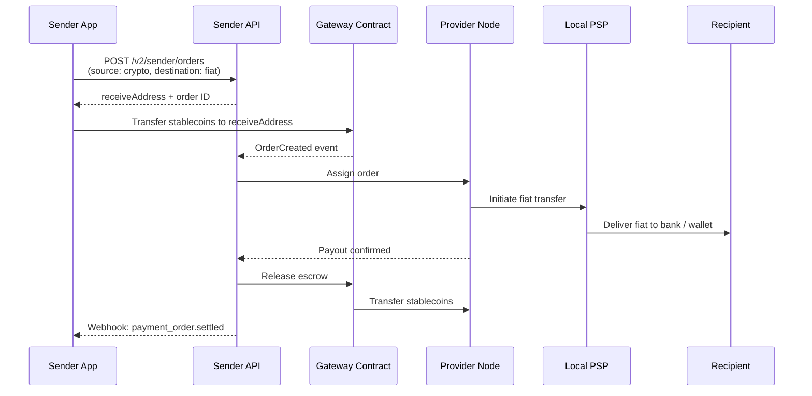
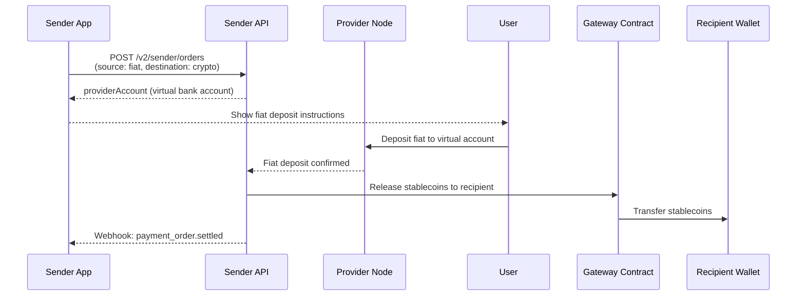

The Sender API lets your app create payment orders in two directions:

- **Offramp** — user sends stablecoins, recipient receives local fiat (bank or mobile wallet)
- **Onramp** — user deposits fiat into a virtual account, recipient receives stablecoins

Both flows use the same endpoint: **`POST /v2/sender/orders`**. Direction comes from the `source` and `destination` types you pass.

**Fastest path to production:** one authenticated create call. The API **validates** bank or mobile account details and **resolves** an acceptable rate inside that request—you are **not** required to call verify-account or the public rates URL first. The sections after [Create a payment order](#create-a-payment-order) cover what happens next (response shape, webhooks). [Optional: prefetch quotes and account names](#optional-prefetch-quotes-and-account-names) explains how to polish checkout when you want prefetching—not because it is required.

## Flow Overview

<Tabs>
  <Tab title="Offramp (Stablecoin → Fiat)">

  </Tab>
  <Tab title="Onramp (Fiat → Stablecoin)">

  </Tab>
</Tabs>

## Getting Started

### 1. Obtain API Credentials

Sign up as a **Sender** at [app.paycrest.io](https://app.paycrest.io) and complete the KYB process. Once verified, you'll have:

- **API Key** — included in every request as the `API-Key` header
- **API Secret** — used to verify webhook signatures; keep this secret

```javascript
const headers = {
  "API-Key": "YOUR_API_KEY",
  "Content-Type": "application/json"
};
```

### 2. Configure Tokens (Optional)

In the dashboard settings, you can set defaults per token/network. **Offramp:** default `refundAddress` (crypto) and `feeAddress`; you can also pass `source.refundAddress` on the request. **Onramp:** you supply **`source.refundAccount`** (fiat bank or mobile details for refunds) in the order payload—configure related defaults in the dashboard where available.

---

## Create a payment order

**`POST /v2/sender/orders`**

Pass a `source` and a `destination` object. The `type` field on each determines the direction. **Offramp** and **onramp** use the same endpoint; examples below include **`curl`** for both directions. The extra **JavaScript** and **Python** snippets are **offramp**-shaped—mirror the **onramp** `curl` payload (`source.type: "fiat"`, `destination.type: "crypto"`, `refundAccount`, etc.) in your language.

<Note>
  **Starknet / Tron:** set `network` to **`starknet`** or **`tron`**. Crypto addresses (`source.refundAddress` on offramp, `destination.recipient.address` on onramp) must match the network: Starknet felt hex (`0x` + 63–64 hex digits) or Tron Base58 (`T…`). Do not pass EVM checksum addresses on these networks. See [Supported Stablecoins](/resources/supported-stablecoins).
</Note>

<Tabs>
  <Tab title="Offramp (stablecoin → fiat)">

User sends stablecoins; recipient receives fiat. Set `source.type = "crypto"` and `destination.type = "fiat"`.

```bash
curl -X POST "https://api.paycrest.io/v2/sender/orders" \
  -H "API-Key: YOUR_API_KEY" \
  -H "Content-Type: application/json" \
  -d '{
    "amount": "100",
    "source": {
      "type": "crypto",
      "currency": "USDT",
      "network": "base",
      "refundAddress": "0xYourWalletAddress"
    },
    "destination": {
      "type": "fiat",
      "currency": "NGN",
      "recipient": {
        "institution": "GTBINGLA",
        "accountIdentifier": "1234567890",
        "accountName": "John Doe",
        "memo": "Salary payment"
      }
    },
    "reference": "order-001"
  }'
```
  </Tab>
  <Tab title="Offramp (Starknet)">

Same shape as EVM offramp; use `network: "starknet"` and a Starknet refund address.

```bash
curl -X POST "https://api.paycrest.io/v2/sender/orders" \
  -H "API-Key: YOUR_API_KEY" \
  -H "Content-Type: application/json" \
  -d '{
    "amount": "100",
    "source": {
      "type": "crypto",
      "currency": "USDT",
      "network": "starknet",
      "refundAddress": "0x046a056257607e1126a73b789bc6b56216e260261d4b54dd0809df46638bcbad"
    },
    "destination": {
      "type": "fiat",
      "currency": "NGN",
      "recipient": {
        "institution": "GTBINGLA",
        "accountIdentifier": "1234567890",
        "accountName": "John Doe",
        "memo": "Salary payment"
      }
    },
    "reference": "order-starknet-001"
  }'
```

After create, transfer Starknet USDT/USDC to `providerAccount.receiveAddress` (also a Starknet address) before `validUntil`. Confirm settlement via webhooks or [GET order by ID](/api-reference/sender/get-payment-order-by-id-v2).
  </Tab>
  <Tab title="Offramp (Tron)">

Same shape as EVM offramp; use `network: "tron"` and a Tron Base58 refund address (starts with `T`).

```bash
curl -X POST "https://api.paycrest.io/v2/sender/orders" \
  -H "API-Key: YOUR_API_KEY" \
  -H "Content-Type: application/json" \
  -d '{
    "amount": "100",
    "source": {
      "type": "crypto",
      "currency": "USDT",
      "network": "tron",
      "refundAddress": "TYourTronWalletAddress............."
    },
    "destination": {
      "type": "fiat",
      "currency": "NGN",
      "recipient": {
        "institution": "GTBINGLA",
        "accountIdentifier": "1234567890",
        "accountName": "John Doe",
        "memo": "Salary payment"
      }
    },
    "reference": "order-tron-001"
  }'
```

After create, transfer Tron USDT to `providerAccount.receiveAddress` (also a Tron address) before `validUntil`. Confirm settlement via webhooks or [GET order by ID](/api-reference/sender/get-payment-order-by-id-v2).
  </Tab>
  <Tab title="Onramp (fiat → stablecoin)">

User deposits fiat; recipient receives stablecoins. Set `source.type = "fiat"` and `destination.type = "crypto"`.

```bash
curl -X POST "https://api.paycrest.io/v2/sender/orders" \
  -H "API-Key: YOUR_API_KEY" \
  -H "Content-Type: application/json" \
  -d '{
    "amount": "50000",
    "amountIn": "fiat",
    "source": {
      "type": "fiat",
      "currency": "NGN",
      "refundAccount": {
        "institution": "GTBINGLA",
        "accountIdentifier": "1234567890",
        "accountName": "John Doe"
      }
    },
    "destination": {
      "type": "crypto",
      "currency": "USDT",
      "recipient": {
        "address": "0xRecipientWalletAddress",
        "network": "base"
      }
    },
    "reference": "order-002"
  }'
```

  </Tab>
  <Tab title="JavaScript (offramp)">
```javascript
const res = await fetch("https://api.paycrest.io/v2/sender/orders", {
  method: "POST",
  headers: { "API-Key": "YOUR_API_KEY", "Content-Type": "application/json" },
  body: JSON.stringify({
    amount: "100",
    source: {
      type: "crypto",
      currency: "USDT",
      network: "base",
      refundAddress: "0xYourWalletAddress"
    },
    destination: {
      type: "fiat",
      currency: "NGN",
      recipient: {
        institution: "GTBINGLA",
        accountIdentifier: "1234567890",
        accountName: "John Doe",
        memo: "Salary payment"
      }
    },
    reference: "order-001"
  })
});
const order = await res.json();
```
  </Tab>
  <Tab title="Python (offramp)">
```python
import requests

order = requests.post(
    "https://api.paycrest.io/v2/sender/orders",
    headers={"API-Key": "YOUR_API_KEY", "Content-Type": "application/json"},
    json={
        "amount": "100",
        "source": {
            "type": "crypto",
            "currency": "USDT",
            "network": "base",
            "refundAddress": "0xYourWalletAddress"
        },
        "destination": {
            "type": "fiat",
            "currency": "NGN",
            "recipient": {
                "institution": "GTBINGLA",
                "accountIdentifier": "1234567890",
                "accountName": "John Doe",
                "memo": "Salary payment"
            }
        },
        "reference": "order-001"
    }
).json()
```
  </Tab>
  <Tab title="JavaScript (onramp)">
```javascript
const res = await fetch("https://api.paycrest.io/v2/sender/orders", {
  method: "POST",
  headers: { "API-Key": "YOUR_API_KEY", "Content-Type": "application/json" },
  body: JSON.stringify({
    amount: "50000",
    amountIn: "fiat",
    source: {
      type: "fiat",
      currency: "NGN",
      refundAccount: {
        institution: "GTBINGLA",
        accountIdentifier: "1234567890",
        accountName: "John Doe",
      },
    },
    destination: {
      type: "crypto",
      currency: "USDT",
      recipient: {
        address: "0xRecipientWalletAddress",
        network: "base",
      },
    },
    reference: "order-002",
  }),
});
const order = await res.json();
```
  </Tab>
  <Tab title="Python (onramp)">
```python
import requests

order = requests.post(
    "https://api.paycrest.io/v2/sender/orders",
    headers={"API-Key": "YOUR_API_KEY", "Content-Type": "application/json"},
    json={
        "amount": "50000",
        "amountIn": "fiat",
        "source": {
            "type": "fiat",
            "currency": "NGN",
            "refundAccount": {
                "institution": "GTBINGLA",
                "accountIdentifier": "1234567890",
                "accountName": "John Doe",
            },
        },
        "destination": {
            "type": "crypto",
            "currency": "USDT",
            "recipient": {
                "address": "0xRecipientWalletAddress",
                "network": "base",
            },
        },
        "reference": "order-002",
    },
).json()
```
  </Tab>
</Tabs>

### Request Fields

| Field | Type | Required | Description |
|-------|------|----------|-------------|
| `amount` | string | ✅ | Payment amount. Denomination set by `amountIn` (defaults to crypto units). |
| `amountIn` | string | — | `"crypto"` (default) or `"fiat"`. Set to `"fiat"` when `amount` is in the fiat currency. |
| `rate` | string | — | Exchange rate (fiat per crypto). **Omit** to let the API choose a valid rate. Pass **`rate`** only when you lock a quote from the user; it must stay within market tolerance. See [Prefetch a quote for the UI](#prefetch-a-quote-for-the-ui) if you display rates before create. |
| `senderFeePercent` | string | — | Optional fee percentage you collect, settled atomically onchain. |
| `reference` | string | — | Your internal order ID. |
| `source` | object | ✅ | `{ type: "crypto", ... }` for offramp; `{ type: "fiat", ... }` for onramp. |
| `destination` | object | ✅ | `{ type: "fiat", ... }` for offramp; `{ type: "crypto", ... }` for onramp. |

---

## KES mobile money (M-Pesa, Till, Paybill)

Kenya offramp to mobile rails uses institution **`SAFAKEPC`** (Safaricom M-Pesa) or another KES **mobile_money** code from **[GET /institutions/KES](/api-reference/general/list-supported-institutions)**. **Till** and **Paybill** are not separate institution codes—you pass them in **`destination.recipient.metadata`**.

| Channel | `metadata.channel` | `accountIdentifier` | Notes |
|---------|-------------------|---------------------|--------|
| Phone M-Pesa | `Mobile` or omit | Mobile number (e.g. `254712345678`) | Default when channel is omitted and the identifier looks like a phone number. Use **`Mobile`** in new integrations (not `MoMo`, which is provider-internal). |
| Till (buy goods) | `Till` | Till / buy-goods number | Do not rely on phone normalization; till numbers are not E.164 phones. |
| Paybill | `Paybill` | Paybill account or reference | Set **`metadata.businessNumber`** to the paybill business number when required. |

**Example — Till**

```json
"destination": {
  "type": "fiat",
  "currency": "KES",
  "recipient": {
    "institution": "SAFAKEPC",
    "accountIdentifier": "123456",
    "accountName": "Merchant Name",
    "memo": "Order 42",
    "metadata": { "channel": "Till" }
  }
}
```

**Example — Paybill**

```json
"destination": {
  "type": "fiat",
  "currency": "KES",
  "recipient": {
    "institution": "SAFAKEPC",
    "accountIdentifier": "INV-001",
    "accountName": "Customer Name",
    "memo": "Invoice",
    "metadata": {
      "channel": "Paybill",
      "businessNumber": "400200"
    }
  }
}
```

**KYC on offramp:** optional **`destination.kyc`** applies to the **recipient** only. Do not send sender or provider KYB on offramp create.

**GET / webhooks (v2):** for offramp orders, **`destination.recipient.metadata`** returns the metadata you supplied on create (same shape as above). **`destination.kyc`** returns destination KYC when stored. There is no v1-style flat metadata fallback on v2 GET.

**Verify-account:** Till and Paybill identifiers are not normalized as mobile phone numbers. Use the exact till or paybill values you will send on the order.

---

## Handle the create response

The create response includes a `providerAccount` whose shape depends on direction: **offramp** gives a **crypto receive address**; **onramp** gives **virtual account / fiat transfer** instructions.

### Offramp — send tokens to `receiveAddress`

```json
{
  "id": "550e8400-...",
  "status": "initiated",
  "providerAccount": {
    "network": "base",
    "receiveAddress": "0xProviderReceiveAddress",
    "validUntil": "2026-03-01T10:05:00Z"
  },
  "source": { "type": "crypto", "currency": "USDT", "network": "base" },
  "destination": { "type": "fiat", "currency": "NGN", "recipient": { ... } }
}
```

Send **exactly** `amount + senderFee + transactionFee` (all returned in the response) in the specified token to `providerAccount.receiveAddress` before `validUntil`.

### Onramp — present virtual account to user

```json
{
  "id": "550e8400-...",
  "status": "initiated",
  "providerAccount": {
    "institution": "Guaranty Trust Bank",
    "accountIdentifier": "0123456789",
    "accountName": "Provider A / John Doe",
    "amountToTransfer": "50000",
    "currency": "NGN",
    "validUntil": "2026-03-01T10:05:00Z"
  },
  "source": { "type": "fiat", "currency": "NGN" },
  "destination": { "type": "crypto", "currency": "USDT", "recipient": { ... } }
}
```

Display the `providerAccount` details to your user. They must transfer exactly `amountToTransfer` in `currency` to `accountIdentifier` before `validUntil`. (There is no onchain token `transfer` from your app for this path—the user moves **fiat** through their bank or mobile wallet.)

---

## Monitor completion

Listen for webhooks or poll `GET /v2/sender/orders/:id`.

### Webhook Events

Configure your webhook URL in the [Sender Dashboard](https://app.paycrest.io). Webhooks use the `payment_order.<status>` format and include a `direction` field (`"offramp"` or `"onramp"`):

```json
{
  "event": "payment_order.settled",
  "webhookVersion": "2",
  "data": {
    "id": "550e8400-...",
    "direction": "offramp",
    "status": "settled",
    "amount": "100",
    "txHash": "0x...",
    ...
  }
}
```

| Event | When it fires |
|-------|--------------|
| `payment_order.deposited` | Stablecoin deposit detected (offramp) |
| `payment_order.pending` | Assigned to provider / fiat deposit confirmed (onramp) |
| `payment_order.validated` | Fiat payout confirmed by provider |
| `payment_order.settling` | Onchain release in progress |
| `payment_order.settled` | Order complete |
| `payment_order.refunding` | Refund in progress |
| `payment_order.refunded` | Funds returned to sender |
| `payment_order.expired` | No deposit received before `validUntil` |

<Note>
  You can notify the user of a successful offramp at `payment_order.validated` — that's when the provider has confirmed fiat delivery. For onramp, use `payment_order.settled` — that's when stablecoins are confirmed onchain.
</Note>

### Verify Webhook Signatures

Verify the `X-Paycrest-Signature` header using HMAC-SHA256 with your API Secret:

The header value is a **hex string** (64 characters for SHA-256). Compare it to your computed hex using **timing-safe equality on the UTF-8 bytes of those strings** (do not `Buffer.from(hex, 'hex')` for the header — that compares raw digest bytes and does not match how the aggregator compares signatures). Normalize the header with **trim** and **lowercase** before comparing.

<Tabs>
  <Tab title="JavaScript">
```javascript
const crypto = require('crypto');

function verifyWebhook(rawBody, signature, secret) {
  const sig = (signature && String(signature).trim().toLowerCase()) || '';
  const key = String(secret || '').trim();
  if (!sig || !key) return false;

  const bodyBuf = Buffer.isBuffer(rawBody) ? rawBody : Buffer.from(rawBody, 'utf8');
  const computed = crypto.createHmac('sha256', key).update(bodyBuf).digest('hex').toLowerCase();
  if (computed.length !== sig.length) return false;
  try {
    return crypto.timingSafeEqual(Buffer.from(computed, 'utf8'), Buffer.from(sig, 'utf8'));
  } catch {
    return false;
  }
}

app.post('/webhook', express.raw({ type: 'application/json' }), (req, res) => {
  const sig = req.headers['x-paycrest-signature'];
  if (!verifyWebhook(req.body, sig, process.env.API_SECRET)) {
    return res.status(401).send('Invalid signature');
  }
  const { event, data } = JSON.parse(req.body);
  // handle event...
  res.sendStatus(200);
});
```
  </Tab>
  <Tab title="Python">
```python
import hmac, hashlib

def verify_webhook(raw_body: bytes, signature: str, secret: str) -> bool:
    sig = (signature or "").strip().lower()
    computed = hmac.new(secret.strip().encode("utf-8"), raw_body, hashlib.sha256).hexdigest().lower()
    return hmac.compare_digest(computed, sig)

@app.route('/webhook', methods=['POST'])
def webhook():
    sig = request.headers.get('X-Paycrest-Signature')
    if not verify_webhook(request.data, sig, os.getenv('API_SECRET')):
        return 'Invalid signature', 401
    payload = request.json
    # handle payload['event'] ...
    return '', 200
```
  </Tab>
  <Tab title="Go">
```go
import (
	"crypto/hmac"
	"crypto/sha256"
	"encoding/hex"
	"io"
	"net/http"
	"strings"
)

func verifyWebhook(body []byte, signature, secret string) bool {
	mac := hmac.New(sha256.New, []byte(strings.TrimSpace(secret)))
	mac.Write(body)
	computed := hex.EncodeToString(mac.Sum(nil))
	sig := strings.ToLower(strings.TrimSpace(signature))
	return hmac.Equal([]byte(computed), []byte(sig))
}

func webhookHandler(w http.ResponseWriter, r *http.Request) {
    body, _ := io.ReadAll(r.Body)
    sig := r.Header.Get("X-Paycrest-Signature")
    if !verifyWebhook(body, sig, os.Getenv("API_SECRET")) {
        http.Error(w, "Invalid signature", http.StatusUnauthorized)
        return
    }
    // handle body...
}
```
  </Tab>
</Tabs>

### Webhook delivery logs & retry

Every webhook we send is recorded as a **delivery** you can inspect and replay — so a briefly-down endpoint no longer means a lost event.

**Automatic retries.** A delivery that fails — either a transport error **or a non-2xx response** — is retried automatically with exponential backoff. Retries continue for a cumulative **24-hour window**, after which the delivery is marked `expired` and we email your sender account once. Return a `2xx` status as soon as you've accepted the event to stop retries.

Each delivery has a `status`:

| Status | Meaning |
|--------|---------|
| `pending` | Queued or awaiting its next retry |
| `success` | Your endpoint returned a 2xx |
| `failed` | Transport error or non-2xx; scheduled for retry |
| `expired` | Gave up after the 24h retry window |

The `trigger` field records what produced an attempt: `automatic` (first send), `cron_retry` (automatic backoff retry), or `manual_sync` / `manual_async` (a retry you initiated).

**Inspect deliveries.** List your deliveries (newest first), filtered by `status`, `event`, `event_id`, `order_id`, or a `from`/`to` date range:

```bash
curl "https://api.paycrest.io/v2/sender/webhooks?status=failed" \
  -H "API-Key: YOUR_API_KEY"
```

Fetch a single delivery to see the frozen request payload and the captured response body (truncated to 4KB):

```bash
curl "https://api.paycrest.io/v2/sender/webhooks/DELIVERY_ID" \
  -H "API-Key: YOUR_API_KEY"
```

**Replay a delivery.** Retry replays the original frozen payload. Use `?sync=true` to replay immediately and get the HTTP result inline:

```bash
curl -X POST "https://api.paycrest.io/v2/sender/webhooks/DELIVERY_ID/retry?sync=true" \
  -H "API-Key: YOUR_API_KEY"
```

Omit `sync` to queue a new delivery for the retry worker instead — the response is `202` with the new delivery's `id`:

```bash
curl -X POST "https://api.paycrest.io/v2/sender/webhooks/DELIVERY_ID/retry" \
  -H "API-Key: YOUR_API_KEY"
```

All three endpoints are scoped to the authenticated sender; another sender's delivery returns `404`. See [List Webhook Deliveries](/api-reference/sender/list-webhook-deliveries), [Get Webhook Delivery](/api-reference/sender/get-webhook-delivery-by-id), and [Retry Webhook Delivery](/api-reference/sender/retry-webhook-delivery).

### Polling

```javascript
async function getOrderStatus(orderId) {
  const { data } = await fetch(`https://api.paycrest.io/v2/sender/orders/${orderId}`, {
    headers: { "API-Key": "YOUR_API_KEY" }
  }).then(r => r.json());

  switch (data.status) {
    case 'validated': // offramp: fiat delivered — safe to notify user
    case 'settled':   // onramp: stablecoins delivered — or offramp fully onchain
    case 'refunded':  // funds returned
    case 'expired':   // no deposit received
  }
  return data;
}
```

---

## Optional: Prefetch quotes and account names

Use this when you want **clearer UX** before the user confirms—not because the API requires extra calls.

### Resolve the account display name early

**`POST /v2/verify-account`** runs the **same checks** again on create, but calling it first cuts down “invalid account” surprises and returns a canonical **`accountName`** for your form.

- **Offramp** — verify the **fiat recipient** you will send in `destination.recipient` (same `institution` and `accountIdentifier` as the order).
- **Onramp** — verify **`source.refundAccount`** (where fiat refunds go), not the crypto wallet in `destination.recipient`.

For **KES Till or Paybill**, pass the same **`accountIdentifier`** and **`metadata.channel`** you will use on create. Phone-style normalization does not apply to till or paybill numbers.

**NGN bank:**

```bash
curl -X POST "https://api.paycrest.io/v2/verify-account" \
  -H "API-Key: YOUR_API_KEY" \
  -H "Content-Type: application/json" \
  -d '{
    "institution": "GTBINGLA",
    "accountIdentifier": "0123456789"
  }'
```

**KES M-Pesa** — you may send local (`07…`) or international (`254…`) MSISDN; the API normalizes to dial code `254` before verification:

```bash
curl -X POST "https://api.paycrest.io/v2/verify-account" \
  -H "API-Key: YOUR_API_KEY" \
  -H "Content-Type: application/json" \
  -d '{
    "institution": "SAFAKEPC",
    "accountIdentifier": "0712345678"
  }'
```

For **KES Till/Paybill**, pass **`metadata`** (e.g. `"channel": "Till"`) so phone normalization is skipped — see [Verify Account](/api-reference/general/verify-account).

A `200 OK` response returns the resolved name in `data`. If `data` is a real name (e.g. `"JOHN DOE"`), use that exact string as `accountName` on the order. If `data` is `"OK"`, name lookup is not available for that corridor—supply your own `accountName`.

### Prefetch a quote for the UI

**`GET /v2/rates/{network}/{from}/{amount}/{to}`** is **public** (no API key). **`from` and `to`** are the fiat code and token symbol in either order. Use it when you want to **show** a rate before submit, or when you will pass **`rate`** on create (it must stay within market tolerance). If you omit **`rate`** on create, the API still picks an acceptable rate.

<Note>
  The JSON `data` object includes **`buy`** and **`sell`** (unless you pass `?side=buy` or `?side=sell`). Use **`data.sell.rate`** for **offramp** and **`data.buy.rate`** for **onramp** when displaying a quote. **`provider_id`** is optional and must be exactly **8 letters** (`A–Z` or `a–z`) if you pin a provider.
</Note>

<Tabs>
  <Tab title="cURL">
```bash
curl "https://api.paycrest.io/v2/rates/base/USDT/100/NGN"
```
  </Tab>
  <Tab title="JavaScript">
```javascript
const res = await fetch("https://api.paycrest.io/v2/rates/base/USDT/100/NGN").then((r) => r.json());
const sellRate = res.data?.sell?.rate; // offramp display
const buyRate = res.data?.buy?.rate;   // onramp display
```
  </Tab>
  <Tab title="Python">
```python
import requests
res = requests.get("https://api.paycrest.io/v2/rates/base/USDT/100/NGN")
data = res.json()["data"]
sell_rate = (data.get("sell") or {}).get("rate")
buy_rate = (data.get("buy") or {}).get("rate")
```
  </Tab>
</Tabs>

---

## Sender Fees

You can optionally charge your users a fee on each order. It's settled atomically onchain — no offchain billing required. Configure your fee in [Sender Dashboard](https://app.paycrest.io) settings (required). You can override it per-request by passing `senderFeePercent` in the order payload.

```json
{
  "amount": "100",
  "senderFeePercent": "0.5",
  ...
}
```

**Offramp:** the total stablecoin amount the user sends to `providerAccount.receiveAddress` is `amount + senderFee + transactionFee`, all returned in the create response. **Onramp:** the user pays **fiat** using `providerAccount.amountToTransfer` (and currency); fee line items in the response still describe what applies on settlement—follow the fields returned for your order.

---

## Testing

Paycrest runs on mainnet only. Test with the minimum order size: **$0.50 on any supported chain**. Use small amounts until you've verified your integration end-to-end.

**Smoke test:** credentials + **`POST /v2/sender/orders`** + handle **`providerAccount`** + one webhook or poll. Add **`verify-account`** and **`GET /v2/rates`** when you are polishing the checkout experience—they are not required to go live.

---

## v1 Legacy API

The v1 API is fully supported for existing integrations. It supports **offramp only** and uses a flat request schema.

<AccordionGroup>
  <Accordion title="v1 Offramp — Create Order">

`POST /v1/sender/orders`

```json
{
  "amount": 100,
  "token": "USDT",
  "network": "base",
  "rate": "1500.50",
  "recipient": {
    "institution": "GTBINGLA",
    "accountIdentifier": "1234567890",
    "accountName": "John Doe",
    "currency": "NGN",
    "memo": "Payment"
  },
  "reference": "order-001",
  "returnAddress": "0xYourWalletAddress"
}
```

The response includes `receiveAddress` (string) and `validUntil`. Send tokens to `receiveAddress`.

  </Accordion>
  <Accordion title="v1 vs v2 Differences">

| Feature | v1 | v2 |
|---------|----|----|
| Offramp | ✅ | ✅ |
| Onramp | ❌ | ✅ |
| Schema | Flat: `token`, `network`, `recipient` | Polymorphic: `source`, `destination` with `type` |
| `refundAddress` | `returnAddress` (top-level) | `source.refundAddress` (offramp); onramp uses `source.refundAccount` |
| Amount direction | Always crypto | `amountIn: "fiat"` or `"crypto"` |
| Sender fee | Fixed via dashboard | Dashboard (fixed) **or** `senderFeePercent` on request |
| Numeric types | Number | String |
| Webhook version | `"1"` | `"2"` |

  </Accordion>
</AccordionGroup>

---

## Related

- [Transaction Lifecycle](/concepts/transaction-lifecycle) — order statuses, webhook events, expired vs refunded
- [Supported Stablecoins](/resources/supported-stablecoins) — tokens, networks, contract addresses
- [Supported Currencies](/resources/supported-currencies) — active fiat corridors
- [API Reference — Sender](/api-reference/sender/initiate-payment-order-v2) — full endpoint spec
